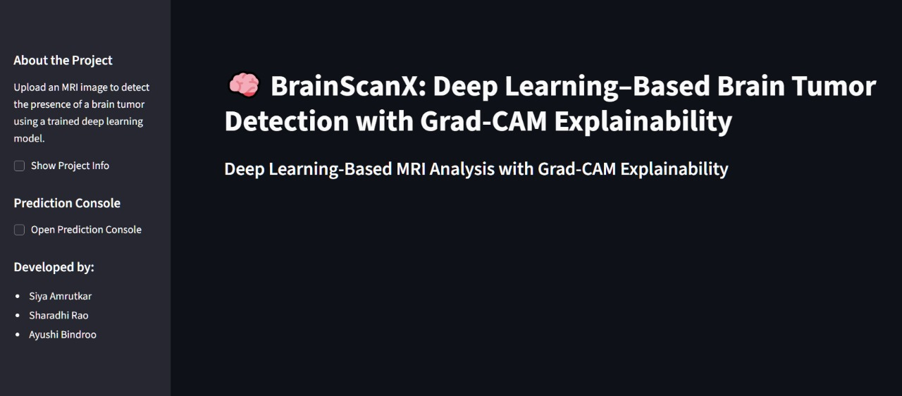
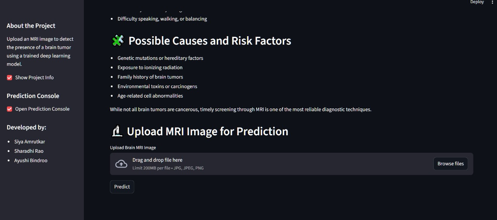
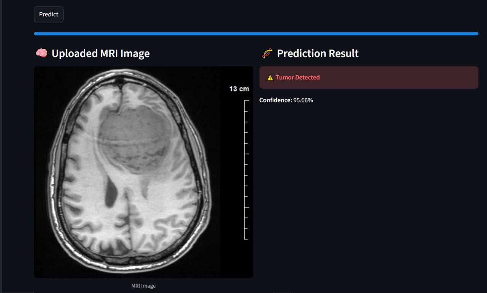
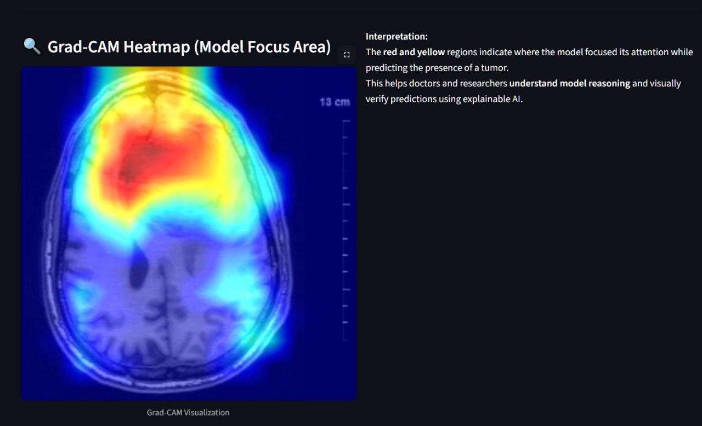

# Brain-Tumor-Detection-System
An end-to-end Deep Learning system for detecting brain tumors from MRI scans using a trained Convolutional Neural Network (CNN) model with Grad-CAM explainability, served through a modern Streamlit interface.

🎯 Project Objective
The objective of this project is to develop an accurate, transparent, and user-friendly AI system that:

- Automatically classifies MRI images as **Tumor** or **No Tumor**
- Provides visual explainability using **Grad-CAM heatmaps**
- Offers a simple and interactive UI for medical or academic use
- Compares CNN performance with **classical ML model (SVM)** to validate deep learning superiority
- Demonstrates practical deployment using **Streamlit**

---

📂 Dataset Details
**Dataset:** Brain Tumor MRI Dataset  
**Total images:** ~253  
- Tumor: ~155  
- No Tumor: ~98  

**Dataset Characteristics:**
- Real MRI scans  
- Varying orientations, sizes, and contrast differences  

**Preprocessing:**
- Resize images to **224×224** for CNN  
- Normalization (pixel scaling 0–1)  
- Conversion to NumPy arrays  
- Train-test split  
- For SVM: grayscale, resize to 64×64, flatten + PCA  

Dataset Source:  
https://www.kaggle.com/datasets/navoneel/brain-mri-images-for-brain-tumor-detection

---

🧠 Algorithms & Models Used

**1️⃣ Convolutional Neural Network (CNN) — Main Model**
- Custom CNN architecture with:
  - Convolution → ReLU → MaxPooling layers  
  - Flatten + Dense layers  
  - Softmax classifier (2 classes)
- Input size: **224×224×3**
- Training:
  - Loss: Categorical Cross-Entropy  
  - Optimizer: Adam  
  - Achieved Accuracy: **95–98%**  
- Output: **Tumor / No Tumor + Confidence score**

**2️⃣ Grad-CAM (Explainable AI)**
- Generates heatmaps that show **where the model is focusing**
- Interprets model decisions visually  
- Highlights tumor-suspected regions  
- Only shown when tumor is detected  

**3️⃣ Support Vector Machine (SVM) — Comparison Model**
- Baseline classical ML model  
- Grayscale + Resize (64×64)  
- PCA for dimensionality reduction  
- SVM (RBF Kernel) for classification  
- Achieved Accuracy: **~74.51%**

**Conclusion:** CNN significantly outperforms SVM due to spatial learning capability.

---

 📊 Results & Performance

✔ **CNN Results**
- Accuracy: **95–98%**
- High precision & recall  
- Grad-CAM clearly highlights tumor regions  
- Reliable predictions on unseen data  

✔ **SVM Results**
- Accuracy: **74.51%**
- Overfits easily  
- Fails to capture MRI spatial patterns  
- Lower reliability  

🔍 Graphs (See Notebook)
- CNN Confusion Matrix  
- SVM Confusion Matrix  
- Training Accuracy/Loss Curves  
- CNN vs SVM Accuracy Comparison Bar Graph  
---

🧪 Conclusion
- The proposed CNN-based system detects brain tumors with **high accuracy and consistency**.  
- Grad-CAM enhances explainability, making the system trustworthy for medical usage.  
- The SVM model demonstrates the limitations of classical approaches, validating the need for CNNs.  
- Streamlit UI makes the model practical, interactive, and easy to use.  
- The project successfully integrates **Deep Learning, Explainable AI, Deployment, and Comparative Analysis**.

---

🚀 Future Scope
- Use larger MRI datasets for better generalization  
- Expand from binary to multi-class tumor classification  
- Integrate advanced architectures (ResNet, EfficientNet, DenseNet)  
- Build 3D CNN models for volumetric MRI analysis  
- Deploy system via cloud API or mobile app  
- Add Grad-CAM++ and LIME for stronger interpretability  
- Include severity prediction or segmentation-based localization  

---

📚 References
1. Brain MRI Dataset:  
   https://www.kaggle.com/datasets/navoneel/brain-mri-images-for-brain-tumor-detection  
2. Grad-CAM Paper (Selvaraju et al., 2017):  
   https://arxiv.org/abs/1610.02391  
3. TensorFlow Documentation:  
   https://www.tensorflow.org/api_docs  
4. Streamlit Documentation:  
   https://docs.streamlit.io  
5. OpenCV Documentation:  
   https://docs.opencv.org/  
6. SVM Paper: https://www.microsoft.com/en-us/research/wp-content/uploads/2016/02/svm.pdf  
7. CS231n CNN Notes: https://cs231n.github.io/convolutional-networks/

---

📁 Folder Structure
BRAIN_TUMOUR_UI/

│

├── app.py # Streamlit frontend

├── predictor.py # Model loading, prediction & Grad-CAM logic

├── text.py # UI content for sidebar and descriptions

├── requirements.txt # Dependencies

│

├── model/

│ └── brain_tumor_model.h5 # Trained CNN model

│

├── Images/ # Optional images for documentation

│

├── temp.jpg # Auto-generated uploaded file

├── gradcam_output.jpg # Auto-generated heatmap output

└── BrainTumorHackathon.ipynb # Full training + SVM comparison notebook

---

🧭 How to Run the Project

1️⃣ Create Virtual Environment (Optional but Recommended)

bash

python -m venv venv

Windows:
venv\Scripts\activate

Mac/Linus
source venv/bin/activate

2️⃣ Install Dependencies

pip install -r requirements.txt

3️⃣ Run Streamlit Web App

streamlit run app.py

Streamlit will launch at:
👉 http://localhost:8501

---

🖥️ Using the App
Open the left sidebar

Read about brain tumors (intro, symptoms, causes)

Click Open Prediction Console

Upload an MRI image

Click Predict

Wait for progress bar

View:

Tumor / No Tumor

Confidence

Grad-CAM heatmap (if tumor detected)

Application UI

Click on console

Upload Image and predict
No tumor - 

Tumor Image - 

Heatmap to highlight tumor - 

---

👨‍💻 Developers

Sharadhi Rao

Siya Amrutkar

Ayushi Bindroo
